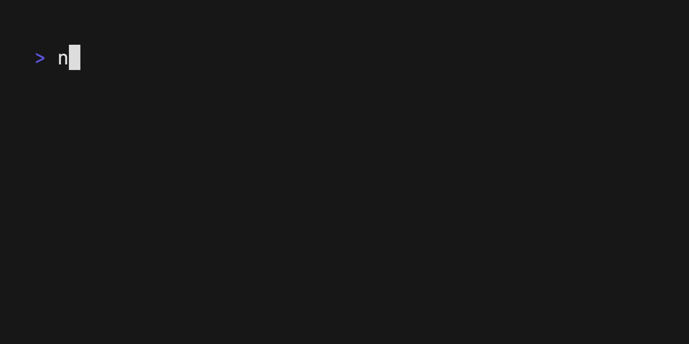

# Brain Games

[](https://codeclimate.com/github/blankstatic/brain-games/maintainability)
[](https://app.travis-ci.com/blankstatic/brain-games)

## Available Games
- brain-even: Determine if a number is even.
- brain-calc: Perform basic arithmetic calculations.
- brain-gcd: Find the greatest common divisor of two numbers.
- brain-progression: Identify the missing number in a sequence.
- brain-prime: Determine if a number is prime.

## Install

To install the games package globally, run the following command in your terminal:

```sh
npm install -g brvingvmes
```

## Usage

To start the game menu, execute the following command in your terminal:

```sh
brain-games
```

## Example

Here’s an example of what you can expect:


